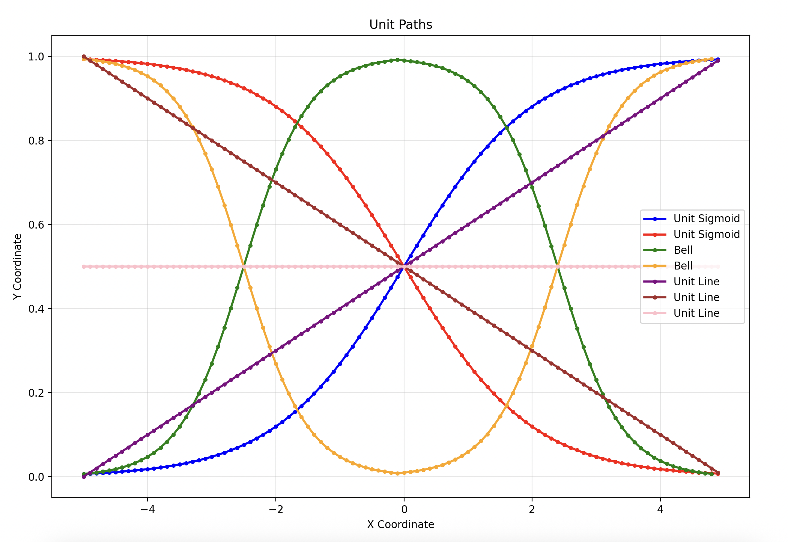
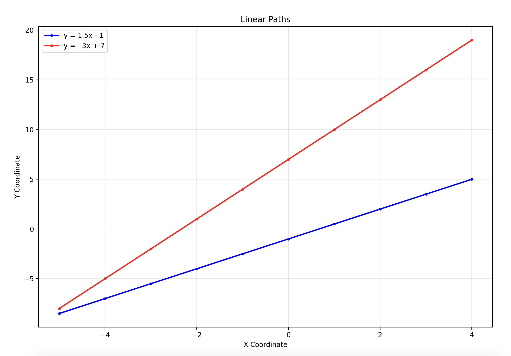
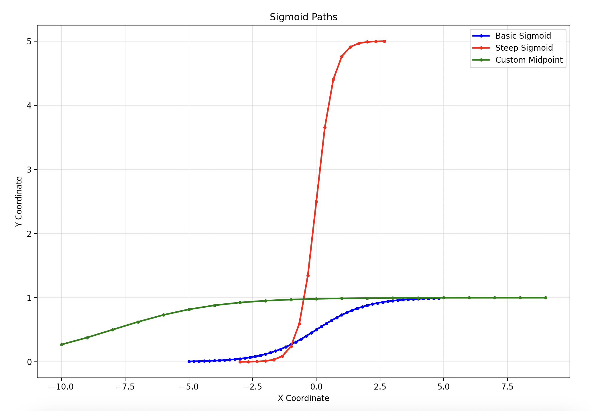
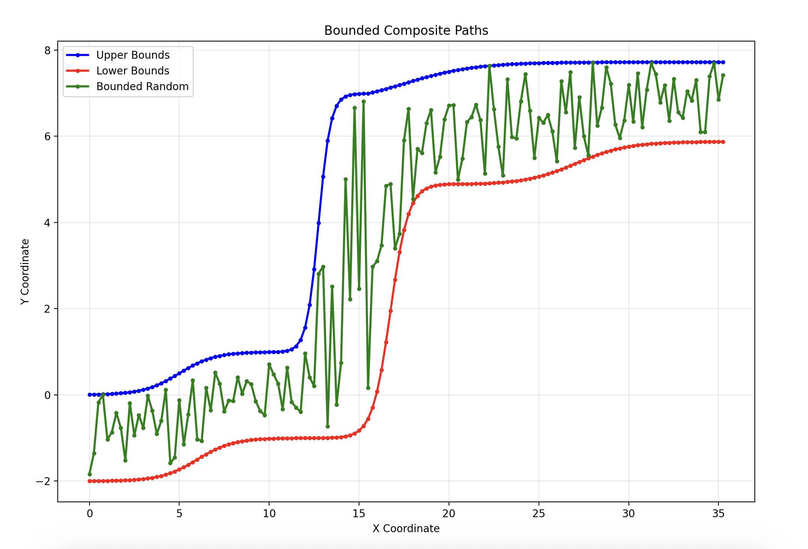
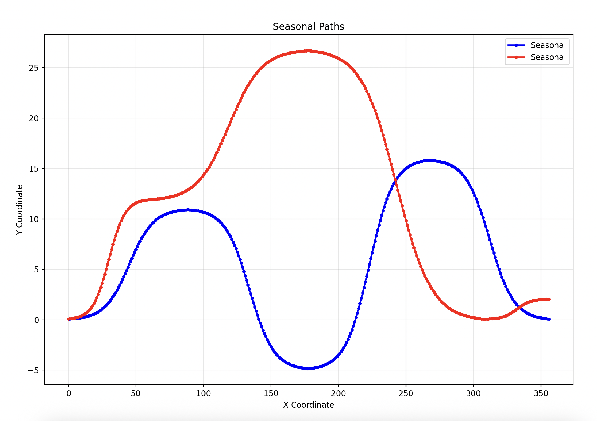

wavely
======

A small library for building curve coordinates from simple
components.

With `wavely`, you can describe a complex curve piecemeal, using
scaled and transalted sigmoid and linear components, mix complex
curves together, and generate noisy, semi-random curves within
constraints.

This is perfect for synthesizing data with observable
characteristics without losing verisimilitude.

I use it for demos.

## Examples

The `examples.py` script will flip through a series of plots,
showing different ways of dealing with the `Linear` and `Sigmoid`
primitives and the `Bounded` aggregate.

